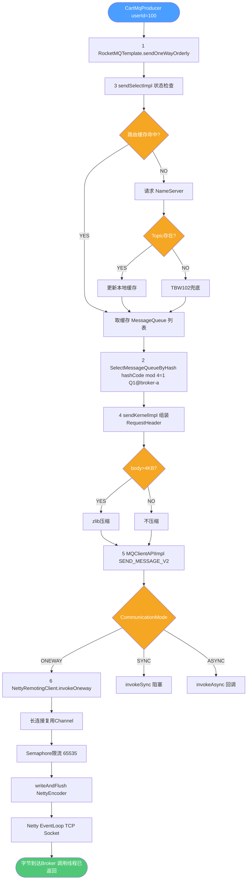

# sendOneWayOrderly 顺序消息发送全链路分析

> 基于 `rocketmq-spring-boot-starter 2.2.3` / `rocketmq-client 4.9.4` 源码
>
> 入口：`RocketMQTemplate#sendOneWayOrderly(String, Message<?>, String)`
> 终点：`NettyRemotingClient#invokeOneway` — 消息离开 JVM

---

## 目录

1. 第一层：RocketMQTemplate.sendOneWayOrderly
2. 第二层：SelectMessageQueueByHash.select
3. 第三层：DefaultMQProducerImpl.sendSelectImpl
4. 第四层：DefaultMQProducerImpl.sendKernelImpl
5. 第五层：MQClientAPIImpl.sendMessage
6. 第六层：NettyRemotingClient.invokeOneway
7. 完整流程图
8. 总结

---

## 1. 第一层：RocketMQTemplate.sendOneWayOrderly

**职责**：Spring 封装层，Spring Message 转 RocketMQ 原生消息，绑定 `SelectMessageQueueByHash`，委托给底层 `DefaultMQProducer`。

```java
public void sendOneWayOrderly(String destination, Message<?> message, String hashKey) {
    // 参数校验：message 和 hashKey 不能为空
    if (Objects.isNull(message) || !StringUtils.hasLength(hashKey)) {
        throw new IllegalArgumentException("`message` and `hashKey` cannot be null");
    }
    // 将 Spring Message 转换为 RocketMQ 原生 Message
    // destination="cart-persist"，Jackson 把 CartPersistMessage 序列化为 JSON 字节
    org.apache.rocketmq.common.message.Message rocketMsg =
        RocketMQUtil.convertToRocketMessage(messageConverter, charset, destination, message);
    try {
        // sendOneway 三参数重载：
        // 参数2：SelectMessageQueueByHash —— 内置 hash 队列选择器
        // 参数3：hashKey（"100"，即 userId）—— 传入选择器作为路由依据
        producer.sendOneway(rocketMsg, new SelectMessageQueueByHash(), hashKey);
    } catch (Exception e) {
        throw RocketMQUtil.convert(e);
    }
}
```

### convertToRocketMessage 关键逻辑

```java
// "cart-persist"        -> topic="cart-persist", tag=""
// "cart-persist:UPSERT" -> topic="cart-persist", tag="UPSERT"
String[] topicWithTag = destination.split(":", 2);
String topic = topicWithTag[0];
String tags  = topicWithTag.length > 1 ? topicWithTag[1] : "";
// Jackson 将 CartPersistMessage 序列化为 UTF-8 JSON 字节
byte[] payloads = (byte[]) converter.fromMessage(message, byte[].class);
// 创建 RocketMQ 原生 Message
return new Message(topic, tags, payloads);
```

---

## 2. 第二层：SelectMessageQueueByHash.select

**职责**：`hashCode(hashKey) % 队列数` 确定目标 MessageQueue，保证相同 hashKey 始终路由到同一个队列。

```java
public MessageQueue select(List<MessageQueue> mqs, Message msg, Object arg) {
    // arg = hashKey = "100"（userId 字符串）
    int value = arg.hashCode();  // "100".hashCode() = 48625
    if (value < 0) {
        value = Math.abs(value); // 防止负数导致数组越界
    }
    // 48625 % 4 = 1  -> 选择 MessageQueue[1]
    // 只要队列数量不变，userId=100 永远路由到 Queue[1]
    value = value % mqs.size();
    // 返回 MessageQueue{topic="cart-persist", brokerName="broker-a", queueId=1}
    return mqs.get(value);
}
```

> **关键约束**：队列数量变化（扩缩容）会导致同一 hashKey 路由到不同 Queue，顺序性临时失效。生产环境不要随意修改队列数量。

---

## 3. 第三层：DefaultMQProducerImpl.sendSelectImpl

**职责**：查询 Topic 路由（优先本地缓存），调用队列选择器，再调用 `sendKernelImpl`。

```java
private SendResult sendSelectImpl(
        Message msg, MessageQueueSelector selector, Object arg,
        CommunicationMode communicationMode, SendCallback sendCallback,
        long timeout) throws ... {

    this.makeSureStateOK();                        // Producer 必须是 RUNNING 状态
    Validators.checkMessage(msg, this.defaultMQProducer); // topic/body 合法性校验

    // 查本地路由缓存 topicPublishInfoTable（ConcurrentHashMap）
    // 未命中 -> 向 NameServer 发 GET_ROUTEINFO_BY_TOPIC 请求
    // NameServer 无该 Topic -> 用 TBW102 兜底（autoCreateTopic）
    // 路由缓存 30s，后台线程定时刷新
    TopicPublishInfo topicPublishInfo =
        this.tryToFindTopicPublishInfo(msg.getTopic());

    if (topicPublishInfo != null && topicPublishInfo.ok()) {
        // 取出该 Topic 所有可写 MessageQueue
        // 例：[Q0@broker-a, Q1@broker-a, Q2@broker-b, Q3@broker-b]
        List<MessageQueue> mqs = mQClientFactory.getMQAdminImpl()
            .parsePublishMessageQueues(topicPublishInfo.getMessageQueueList());

        // 调用 SelectMessageQueueByHash.select(mqs, msg, "100")
        // 返回 Q1@broker-a
        MessageQueue mq = selector.select(mqs, msg, arg);
        if (mq != null) {
            return this.sendKernelImpl(msg, mq, communicationMode, sendCallback, null, timeout);
        }
    }
    throw new MQClientException("No route info for topic: " + msg.getTopic());
}
```

### 路由查询决策树

```
tryToFindTopicPublishInfo("cart-persist")
  ├─ 本地缓存命中且有效  -> 直接返回，不访问 NameServer
  └─ 未命中或过期
        -> 请求 NameServer: GET_ROUTEINFO_BY_TOPIC
              ├─ 有该 Topic   -> 更新缓存，返回路由
              └─ 无该 Topic   -> TBW102 兜底（autoCreateTopic）
```

---

## 4. 第四层：DefaultMQProducerImpl.sendKernelImpl

**职责**：brokerName 转 IP、消息压缩、组装 RequestHeader、调用网络层。

```java
private SendResult sendKernelImpl(
        Message msg, MessageQueue mq,
        CommunicationMode communicationMode,
        SendCallback sendCallback,
        TopicPublishInfo topicPublishInfo, long timeout) throws ... {

    // 第1步：brokerName -> IP:Port（写操作必须发往 Master，MasterID=0）
    String brokerAddr = this.mQClientFactory
        .findBrokerAddressInPublish(mq.getBrokerName()); // "192.168.1.100:10911"
    if (brokerAddr == null) {
        // 缓存无此 Broker，重新从 NameServer 拉取路由
        this.mQClientFactory.updateTopicRouteInfoFromNameServer(mq.getTopic());
        brokerAddr = this.mQClientFactory.findBrokerAddressInPublish(mq.getBrokerName());
    }

    // 第2步：消息压缩（body > 4KB 时 zlib 压缩）
    int sysFlag = 0;
    if (this.tryToCompressMessage(msg)) {
        sysFlag |= MessageSysFlag.COMPRESSED_FLAG; // 压缩标志位
    }

    // 第3步：组装 SendMessageRequestHeader（发往 Broker 的请求元数据）
    SendMessageRequestHeader requestHeader = new SendMessageRequestHeader();
    requestHeader.setProducerGroup(this.defaultMQProducer.getProducerGroup()); // "cart-producer-group"
    requestHeader.setTopic(msg.getTopic());      // "cart-persist"
    requestHeader.setQueueId(mq.getQueueId());   // 1（由 hash 选定）
    requestHeader.setBornTimestamp(System.currentTimeMillis()); // 产生时间戳
    requestHeader.setFlag(msg.getFlag());
    requestHeader.setProperties(MessageDecoder.messageProperties2String(msg.getProperties()));
    requestHeader.setReconsumeTimes(0);          // 首次发送，重试次数=0
    requestHeader.setSysFlag(sysFlag);           // 压缩标志
    requestHeader.setBatch(false);               // 非批量

    // 第4步：调用网络层（ONEWAY 进入 invokeOneway 分支）
    return this.mQClientFactory.getMQClientAPIImpl().sendMessage(
        brokerAddr, mq.getBrokerName(), msg, requestHeader,
        timeout, communicationMode, sendCallback,
        topicPublishInfo, this.mQClientFactory,
        this.defaultMQProducer.getRetryTimesWhenSendFailed(), context, this);
    // OneWay 模式返回 null
}
```

---

## 5. 第五层：MQClientAPIImpl.sendMessage

**职责**：封装 `RemotingCommand`，按模式（ONEWAY/SYNC/ASYNC）分发到 Netty 层。

```java
public SendResult sendMessage(
        String addr, String brokerName, Message msg,
        SendMessageRequestHeader requestHeader,
        long timeoutMillis, CommunicationMode communicationMode, ...) throws ... {

    // 第1步：构建 RemotingCommand
    // V2 Header：字段名用数字编码，减少序列化体积
    SendMessageRequestHeaderV2 v2 =
        SendMessageRequestHeaderV2.createSendMessageRequestHeaderV2(requestHeader);
    RemotingCommand request = RemotingCommand.createRequestCommand(
        RequestCode.SEND_MESSAGE_V2, v2); // 命令码：单条消息发送
    request.setBody(msg.getBody()); // Body = CartPersistMessage JSON 字节

    // 第2步：按模式分发
    switch (communicationMode) {
        case ONEWAY:
            this.remotingClient.invokeOneway(addr, request, timeoutMillis);
            return null; // OneWay 无返回值
        case ASYNC:
            // 注册回调，Broker 响应后触发 sendCallback（省略）
        case SYNC:
        default:
            // 阻塞等待 Broker ACK，超时抛异常（省略）
    }
    return null;
}
```

### RemotingCommand 协议帧结构

```
+----------+----------+--------------+------------------------+
|  4 字节  |  4 字节  |   N 字节     |   M 字节               |
|  总长度  | Header长 | Header JSON  | Body（消息 JSON 字节） |
+----------+----------+--------------+------------------------+
```


---

## 6. 第六层：NettyRemotingClient.invokeOneway

**职责**：从连接池获取 Channel，Semaphore 限流，writeAndFlush 异步写出，调用线程立即返回。

核心步骤：

1. getAndCreateChannel —— 连接池获取活跃 Channel，无则 TCP 握手建新连接
2. semaphoreOneway.tryAcquire —— 默认最大 65535 并发 OneWay 请求
3. channel.writeAndFlush —— NettyEncoder 编码后异步写入 TCP Socket
4. 调用线程立即返回，不等 Broker ACK，整个链路结束

OneWay 写入失败时仅打印日志，不重试、不上报调用方。

### NettyEncoder 编码过程

NettyEncoder 将 RemotingCommand 按如下格式写入 ByteBuf：

- 4 字节：总长度
- 4 字节：Header 长度
- N 字节：Header JSON（请求元数据）
- M 字节：Body（CartPersistMessage JSON 字节）

Netty EventLoop 线程负责将 ByteBuf 写入 TCP Socket 发往 Broker。

---

## 7. 完整流程图



---

## 8. 总结

### 8.1 各层职责表

| 层级 | 类/方法 | 职责 |
|---|---|---|
| Spring封装层 | RocketMQTemplate.sendOneWayOrderly | 参数校验、Spring Message转RocketMQ Message、绑定队列选择器 |
| 队列选择层 | SelectMessageQueueByHash.select | hashCode(hashKey)%队列数，保证同key路由一致 |
| Producer核心层 | DefaultMQProducerImpl.sendSelectImpl | 查路由缓存30s，未命中请求NameServer |
| 消息编码层 | DefaultMQProducerImpl.sendKernelImpl | brokerName转IP、压缩、组装RequestHeader |
| 网络协议层 | MQClientAPIImpl.sendMessage | 封装RemotingCommand，按模式分发 |
| Netty传输层 | NettyRemotingClient.invokeOneway | 连接池复用、Semaphore限流、writeAndFlush |
| 编码器 | NettyEncoder | RemotingCommand转[4B总长][4B头长][Header JSON][Body] |

### 8.2 OneWay vs Sync vs Async 本质区别

| 维度 | OneWay | Sync | Async |
|---|---|---|---|
| 调用线程阻塞 | 否，立即返回 | 是，等Broker ACK | 否，注册回调后返回 |
| 返回值 | 无(null) | 有SendResult | SendCallback回调 |
| 可靠性 | 最低，极小概率丢消息 | 最高 | 中 |
| 吞吐量 | 最高 | 最低 | 高 |
| 适用场景 | 日志监控等允许丢失 | 金融订单等强可靠 | 高并发且需感知结果 |
| 超时处理 | 写入前限流，写入后不管 | 超时抛RemotingTimeoutException | 超时触发onException |

### 8.3 顺序性保证关键链

hashKey(userId)不变
  -> SelectMessageQueueByHash选定固定MessageQueue
  -> 同一MessageQueue同一时刻只有一个Consumer持有(ORDERLY锁)
  -> Consumer串行消费，落库顺序=发送顺序 -> 顺序性成立

破坏顺序性的情况：
- 队列数量变化(扩缩容) -> hash结果改变 -> 顺序性临时失效
- OneWay极小概率丢消息 -> 生产建议改用syncSendOrderly
- Consumer Rebalance期间 -> Queue暂无人消费，短暂延迟

### 8.4 生产环境建议

| 当前写法 | 生产建议 | 原因 |
|---|---|---|
| sendOneWayOrderly | 改为syncSendOrderly | OneWay不等ACK，Broker宕机时消息丢失 |
| 无异常重试 | 加重试逻辑+死信队列告警 | 网络抖动时sync抛异常，需捕获重试 |
| 固定队列数 | 扩缩Topic队列数前停写 | 动态变更队列数破坏顺序性 |
