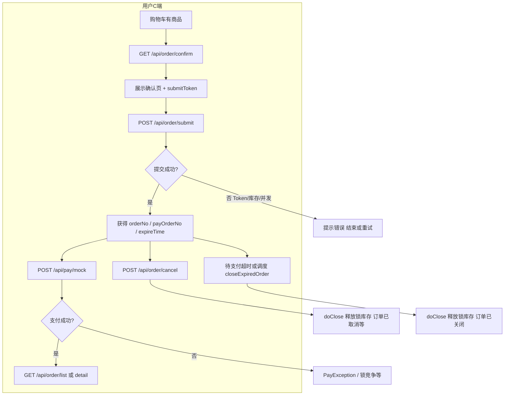
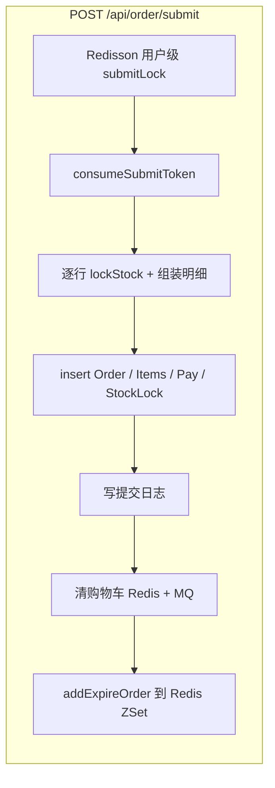
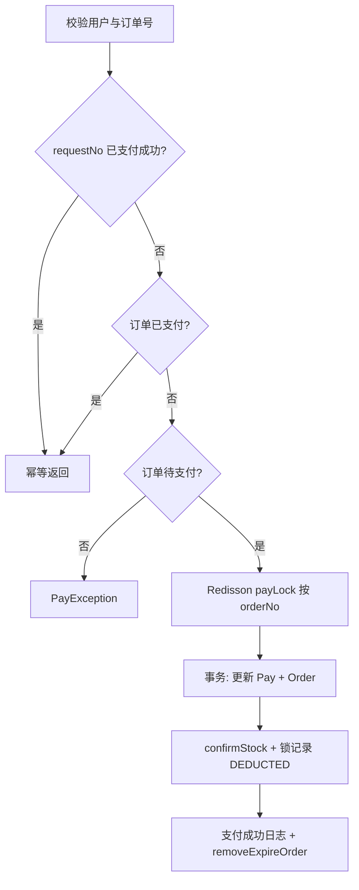

# 订单与支付流程文档（C 端）

> 基于 `com.fireworks.api.controller.ApiOrderController` 与配套 `OmsOrderServiceImpl` / `OmsPayServiceImpl` 整理，便于复习订单确认 → 提交 → 支付 → 查询 → 取消的完整链路。  
> 所有 C 端订单接口均需登录态：`SecurityContextHolder` 中取当前会员 ID。

---

## 一、接口一览（源码声明顺序）

| 顺序 | 方法 | 路径 | 说明 |
|------|------|------|------|
| 1 | GET | `/api/order/confirm` | 订单确认页数据 |
| 2 | POST | `/api/order/submit` | 提交订单 |
| 3 | GET | `/api/order/list` | 订单分页列表 |
| 4 | GET | `/api/order/detail` | 订单详情 |
| 5 | POST | `/api/order/cancel` | 取消订单（待支付） |

**与支付闭环衔接（同模块 API，非 OrderController 内，但属于「订单支付」必走路径）：**

| 方法 | 路径 | 说明 |
|------|------|------|
| POST | `/api/pay/mock` | 模拟支付成功（幂等 `requestNo` + 支付分布式锁） |

---

## 二、推荐业务顺序与各接口详解

下面按 **用户从购物车到支付成功** 的**时间顺序**说明；数字对应上一节表中「典型步骤」，不必与 Controller 源码行序一致。

### 1. GET `/api/order/confirm` — 订单确认页

**作用**：下单前展示「可结算商品」与金额，并签发 **submitToken**，供下一步提交时做幂等。

**查询参数**：

- `productIds`（可选）：逗号分隔的商品 ID 列表。不传或空列表表示**购物车全部条目**参与校验；若传了则只校验列表内的商品。

**服务侧要点**（`OmsOrderServiceImpl#confirm`）：

1. 从 Redis 读取当前用户购物车 `cartRedisHelper.getCart(userId)`。
2. 遍历购物车条目，按 `productIds` 过滤。
3. 对每条调用 DB 查 `PmsProduct`，**不满足则跳过**（不报错）：商品不存在/非上架、可用库存 `(stock - lockStock) < 数量`、超单笔限购等。
4. 汇总为 `OrderConfirmVO`：行项目、件数、`totalAmount`。
5. `orderRedisHelper.createSubmitToken(userId)` 生成 **submitToken** 写入 Redis，随 VO 返回。
6. `sourceType` 固定为购物车来源枚举值（当前实现为购物车场景）。

**与其它接口的关系**：

- **输出** `submitToken`、`items`（含价格快照字段）→ **POST submit** 必须携带**同一** `submitToken`，且 `items` 应与前端展示一致（否则提交时仍会按 DB 再次校验并锁库，可能失败）。
- 确认页**不落库**、**不锁库存**；仅读模型展示 + Token。

---

### 2. POST `/api/order/submit` — 提交订单

**作用**：在**单用户分布式锁** + **事务**内创建订单、支付单、库存锁定记录，并清购物车、注册超时关单。

**请求体** `OrderSubmitParam`（校验由 `@Validated` 触发）：

- `submitToken`：必填，须与 confirm 返回一致；提交成功后会被 **consume（删除）**，重复提交同一 Token 会 `RepeatSubmitException`。
- `sourceType`：订单来源（如购物车、立即购买等枚举码）。
- `items`：非空，每项含 `productId`、`quantity`。
- 收货人姓名、电话、省市区、详细地址必填；`remark` 可选。

**服务侧要点**（`submit` → `doSubmit`）：

1. **Redisson** `buildSubmitLockKey(userId)`：**同一用户**串行提交，`tryLock(3s, 5s lease)`，失败提示「操作频繁」。
2. **consumeSubmitToken**：失败则「请勿重复提交订单」。
3. 对 `items` 逐行：
   - 查商品，校验存在、上架、库存、限购；
   - `productMapper.lockStock` 乐观/条件更新锁库存，失败抛 `StockException`。
4. 生成 `orderNo`、`expireTime`（当前代码为 **下单时刻 + 15 分钟**）。
5. 插入 `OmsOrder`：状态 **待支付**、支付状态 **待支付**。
6. 插入 `OmsOrderItem`（行上带 `orderId`）。
7. 生成 `payOrderNo`，插入 `OmsOrderPay`：**模拟支付类型**、金额、待支付。
8. 为每行插入 `OmsOrderStockLock`：**LOCKED**，过期时间与订单一致。
9. 写操作日志（提交订单）。
10. 购物车：`removeItem` + `cartMqProducer.sendDelete`（Redis 与 MQ 侧一致清理）。
11. `orderRedisHelper.addExpireOrder(orderNo, expireTime)`：把订单号放入 Redis **ZSet**，供超时调度关单（见下文说明）。

**返回** `OrderSubmitVO`：`orderId`、`orderNo`、`payOrderNo`、`orderStatus`、`payStatus`、`expireTime`、`payAmount`。

**与其它接口的关系**：

- **输入**依赖 **confirm** 的 `submitToken`（以及前端构造的收货信息与行项目）。
- **输出** `orderNo` / `payOrderNo` → **POST `/api/pay/mock`** 用 `orderNo` 发起支付；列表/详情用 `orderNo` 查询。
- 提交后订单处于 **待支付**；若未支付，可走 **cancel** 或 **超时关闭**（释放锁库存）。

---

### 3. POST `/api/pay/mock` — 模拟支付（完成支付闭环）

**说明**：定义在 `ApiPayController`，与订单接口并列，复习「订单支付」时需连在一起。

**请求体** `MockPayParam`：

- `orderNo`：目标订单。
- `requestNo`：客户端生成的**支付请求幂等号**；同一 `requestNo` 若已对应成功支付记录，直接返回成功（防重复扣款/重复记账）。

**服务侧要点**（`OmsPayServiceImpl`）：

1. 校验订单归属当前用户。
2. 若 `requestNo` 已在 `OmsOrderPay` 上且已支付成功 → 幂等返回。
3. 若订单已是已支付 → 幂等返回。
4. 仅 **待支付** 订单允许支付，否则 `PayException`。
5. Redisson `buildPayLockKey(orderNo)`：**同一订单**支付串行。
6. 事务 `doPayInTx`：
   - 更新支付单：成功状态、`requestNo`、mock 三方单号、`payTime` 等；
   - 更新订单：订单状态 **已支付**、支付状态 **成功**；
   - 遍历 **LOCKED** 的 `OmsOrderStockLock`：`confirmStock` 扣减真实库存，锁记录改为 **DEDUCTED**；
   - 写支付成功操作日志；
   - `removeExpireOrder`：从超时 ZSet 移除（已支付不再关单）。

**与其它接口的关系**：

- 接在 **submit** 之后；成功后 **list/detail** 可见状态变为已支付。
- 与 **cancel/超时关闭** 互斥：只有待支付可关单；已支付走退款需另做（当前项目未在本文档接口中体现）。

---

### 4. GET `/api/order/list` — C 端订单列表

**作用**：当前登录用户分页查自己的订单摘要。

**查询参数** `OmsOrderQueryParam`（Controller 绑定 QueryString）：

- `orderNo`、`orderStatus`、`payStatus`、`createTimeStart`、`createTimeEnd`、`pageNum`、`pageSize` 等；**userId 由服务端强制设为当前用户**，前端不可冒充他人。

**服务侧**：`orderMapper.selectOrderPage` 分页查询，封装 `PageResult<OmsOrderListItemVO>`。

**关系**：用于支付前后**浏览订单**；与 **detail** 为列表-详情组合。

---

### 5. GET `/api/order/detail` — C 端订单详情

**作用**：按 `orderNo` 查单笔订单主表 + 行表，组装 `OmsOrderDetailVO`。

**校验**：订单必须属于当前用户，否则 `OrderException`（无权查看）。

**关系**：支付成功前后均可查；可展示 `expireTime` 等用于倒计时关单提示。

---

### 6. POST `/api/order/cancel` — 取消订单

**作用**：用户在 **待支付** 状态下主动关单，**释放锁库存**（与超时关闭逻辑同源 `doClose`）。

**请求体** `OrderCancelParam`：含 `orderNo`。

**服务侧要点**：

1. 校验订单归属。
2. `doClose`：仅 `WAIT_PAY` 允许；Redisson **关单锁** `buildCloseLockKey(orderNo)`；再次读库确认仍待支付。
3. 更新订单为 **已取消**（用户取消场景）、支付单为关闭态；**LOCKED** 库存锁 → `releaseStock` + 锁记录 **RELEASED**；写日志；`removeExpireOrder`。

**关系**：与 **submit** 相对——提交增锁，取消/超时释放锁；与 **mock 支付** 互斥（支付成功后不能再 cancel 这条路径）。

---

## 三、订单超时关闭（后台机制，与接口的关系）

- 提交订单时会把 `orderNo` 与过期时间写入 Redis ZSet（`addExpireOrder`）。
- `OrderExpireScheduler` 默认每 10s 调度一次，通过 **Lua（ZRANGE 取最小 score + ZREM）** 弹出 `order:expire:zset` 中的订单号并调用 `closeExpiredOrder`（不使用 `ZPOPMIN`，兼容 Redis 5 以下）。
- 一旦执行 `closeExpiredOrder` 且订单仍待支付，效果与用户取消类似：关单、关支付单、**释放锁库存**，订单状态为 **已关闭**（超时场景），并清理 ZSet 中的记录。

复习时请区分：**用户取消** → `CANCELED`；**超时/后台关** → 实现里目标状态为 `CLOSED`（与枚举注释一致）。

---

## 四、核心状态简表

| 概念 | 关键取值（以枚举为准） |
|------|------------------------|
| 订单状态 | 0 待支付 → 1 已支付；取消 2；关闭 3 等 |
| 支付状态 | 与订单支付流配合；关单时支付单也会置为关闭 |
| 库存锁 | 提交后 LOCKED；支付成功 DEDUCTED；取消/超时 RELEASED |

---

## 五、详细流程图

### 5.1 主流程（确认 → 提交 → 支付 → 查询 / 取消分支）

### 5.2 提交订单内部（用户锁 + Token + 事务）

### 5.3 模拟支付内部（幂等 + 订单锁 + 事务）

### 5.4 取消 / 超时关闭（doClose 共性）

---

## 六、复习要点速记

1. **confirm** 只读 + Token，**不锁库**。  
2. **submit** 消耗 Token、**用户锁**、**行级 lockStock**、写四类表（订单/明细/支付/库存锁）、清购物车、注册过期。  
3. **mock 支付** 用 **requestNo** 幂等 + **订单级 payLock**，成功则 **confirmStock** 与锁 **DEDUCTED**。  
4. **cancel** 仅待支付，与用户/超时关单共用 **doClose** 释放库存锁。  
5. **list/detail** 强制当前 `userId`，防水平越权。

---

*文档生成自仓库当前代码；若调度任务或枚举与生产配置不一致，以实际部署为准。*
